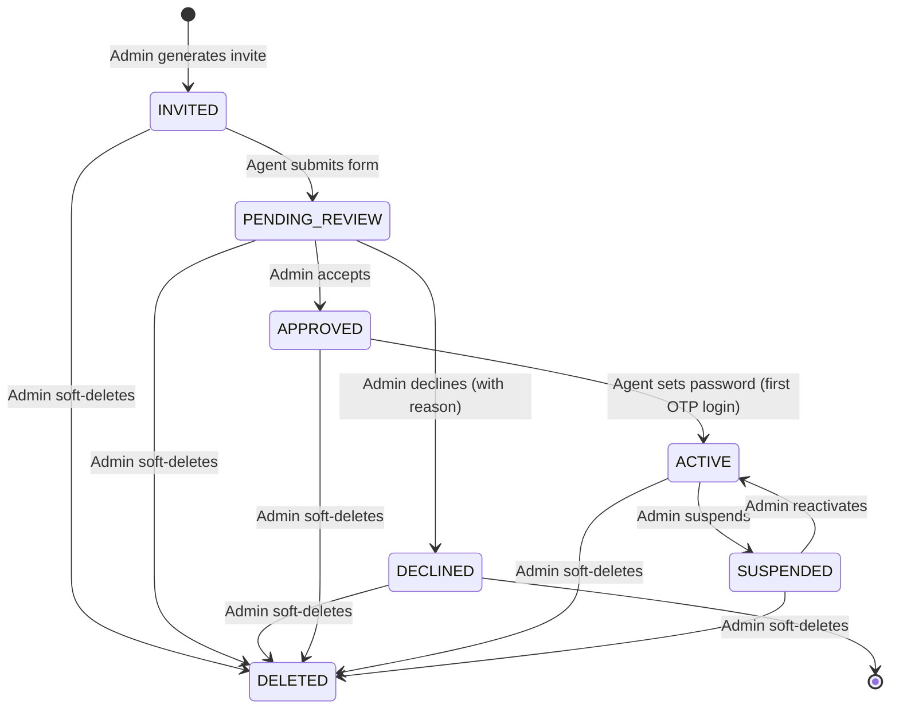
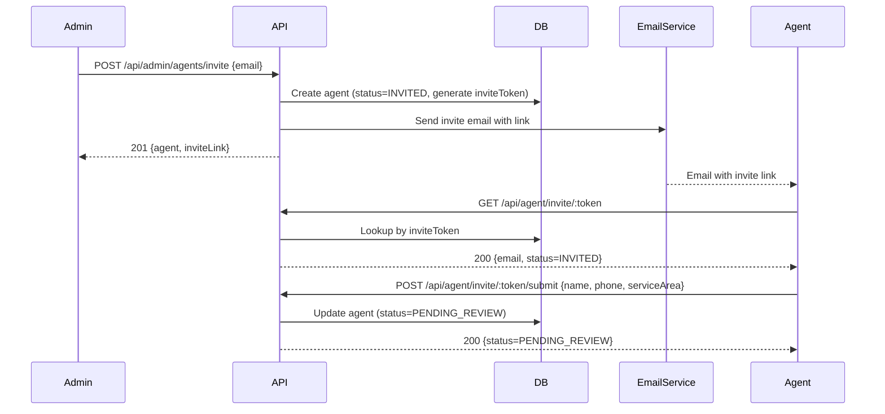
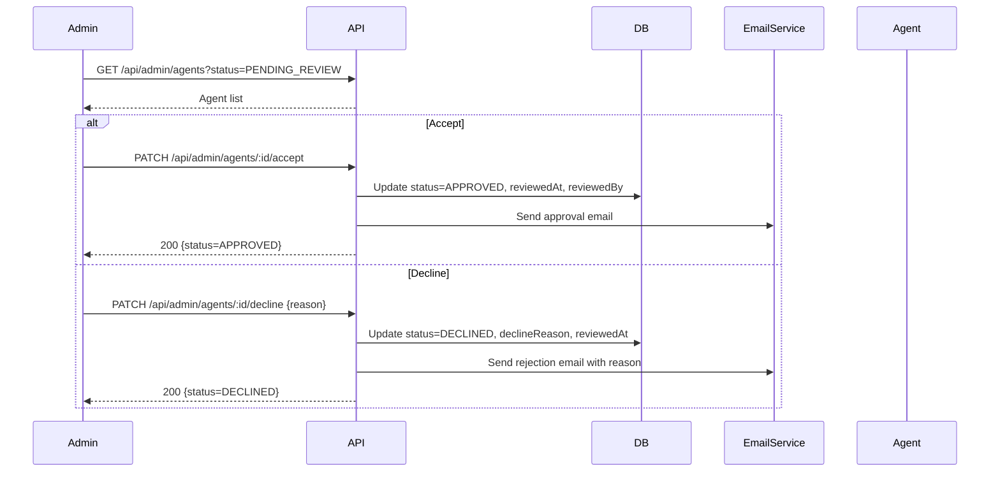
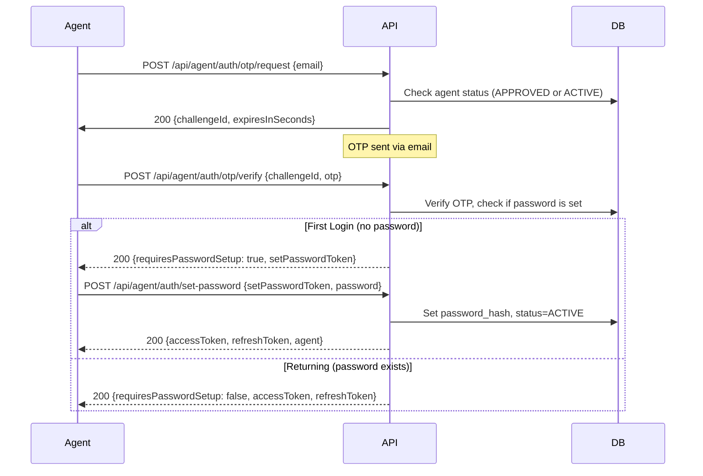

# Agent Onboarding — Complete Admin & Agent Flow Documentation

> **Note:** This document covers the **full agent lifecycle** from invitation through active login. It is designed as a best-practice reference for your backend API implementation.

---

## 1. Agent Status Lifecycle



| Status | Meaning |
|---|---|
| `INVITED` | Invite email sent; agent has not yet filled the form |
| `PENDING_REVIEW` | Agent submitted the onboarding form; awaiting admin decision |
| `APPROVED` | Admin accepted the agent; agent can now OTP-login & set password |
| `DECLINED` | Admin rejected the agent (reason stored) |
| `ACTIVE` | Agent completed first login and set a password |
| `SUSPENDED` | Admin temporarily disabled the agent |
| `DELETED` | Soft-deleted by admin; hidden from all lists, data retained in DB |

---

## 2. Flow Overview

### 2.1 — Admin Invites Agent

1. Admin enters agent's **email** in the Admin Panel.
2. Backend creates an `Agent` record with status = `INVITED`.
3. Backend sends an **invite email** containing a unique link:
   `https://abdoun.com/{locale}/agent-invite?token={inviteToken}`
4. Admin sees the agent appear in the list with status badge **Invited**.

### 2.2 — Agent Accepts Invitation (Fills the Form)

1. Agent clicks the link → lands on the **Agent Invite Form** page.
2. Agent fills: **Full Name**, **Phone**, **Service Area**.
3. On submit, backend updates the agent record:
   - Stores name, phone, serviceArea
   - Status changes to `PENDING_REVIEW`
4. Agent sees a confirmation: *"Your application is under review."*

### 2.3 — Admin Reviews Agent

1. Admin navigates to **Agents List** → filters by status `PENDING_REVIEW`.
2. Admin clicks **Accept** or **Decline**.
   - **Accept** → status becomes `APPROVED`, email sent to agent: *"You have been approved. Log in here."*
   - **Decline** → admin provides a **rejection reason** → status becomes `DECLINED`, email sent to agent with the reason.

### 2.4 — Agent First Login (OTP → Set Password)

1. Agent navigates to **Agent Login** page, enters email.
2. Backend validates agent status = `APPROVED` or `ACTIVE`, then sends **OTP** to the email.
3. Agent enters OTP → backend verifies.
4. **If first login** (no password set yet):
   - Backend returns a `setPasswordToken`.
   - Frontend redirects to **Set Password** screen.
   - Agent creates a password → status becomes `ACTIVE`.
5. **Subsequent logins**:
   - Agent logs in with **email + password** (standard credential login).
   - OTP flow is available as a fallback or 2FA.

---

## 3. Database Schema — `agents` Table

| Column | Type | Notes |
|---|---|---|
| `id` | UUID / string | Primary key, e.g. `agt_xxxxxxxx` |
| `email` | string (unique) | Agent's email address |
| `full_name` | string (nullable) | Populated when agent submits the form |
| `phone` | string (nullable) | E.164 format |
| `service_area` | string (nullable) | City / region |
| `status` | enum | `INVITED`, `PENDING_REVIEW`, `APPROVED`, `DECLINED`, `ACTIVE`, `SUSPENDED` |
| `password_hash` | string (nullable) | Set on first login |
| `decline_reason` | string (nullable) | Stored when admin declines |
| `invite_token` | string (unique) | Unique token embedded in the invite link |
| `invited_by` | string / FK | Admin who sent the invite |
| `invited_at` | datetime | When the invite was created |
| `form_submitted_at` | datetime (nullable) | When agent submitted the form |
| `reviewed_at` | datetime (nullable) | When admin approved/declined |
| `reviewed_by` | string / FK (nullable) | Admin who reviewed |
| `password_set_at` | datetime (nullable) | When agent set password |
| `created_at` | datetime | Record creation |
| `updated_at` | datetime | Last modification |
| `deleted_at` | datetime (nullable) | When admin soft-deleted the agent (null = not deleted) |
| `deleted_by` | string / FK (nullable) | Admin who soft-deleted |

---

## 4. API Endpoints

### 4.1 — Admin: Generate Invite Link

Creates the agent record and returns the invite link. **Does NOT send any email** — the admin can copy the link from the UI.

```
POST /api/admin/agents/invite
```

**Headers:** `Authorization: Bearer <adminAccessToken>`

**Request Body:**
```json
{
  "email": "agent@example.com"
}
```

**Response `201 Created`:**
```json
{
  "success": true,
  "data": {
    "id": "agt_abc12345",
    "email": "agent@example.com",
    "status": "INVITED",
    "inviteLink": "https://abdoun.com/en/agent-invite?token=inv_xYz789",
    "invitedAt": "2026-03-02T13:00:00.000Z",
    "invitedBy": "admin_001"
  },
  "message": "Invite link generated for agent@example.com"
}
```

**Error `409 Conflict`:**
```json
{
  "success": false,
  "error": "AGENT_ALREADY_EXISTS",
  "message": "An agent with this email already exists."
}
```

**Error `400 Bad Request`:**
```json
{
  "success": false,
  "error": "INVALID_EMAIL",
  "message": "Please enter a valid email address."
}
```

---

### 4.2 — Admin: Send Invite via Email

Sends the invite link to the agent's email. Called when admin clicks **"Send via email"** in the dialog.

```
POST /api/admin/agents/:agentId/send-invite-email
```

**Headers:** `Authorization: Bearer <adminAccessToken>`

**Request Body:** _(empty)_
```json
{}
```

**Response `200 OK`:**
```json
{
  "success": true,
  "data": {
    "id": "agt_abc12345",
    "email": "agent@example.com",
    "sentAt": "2026-03-02T13:01:00.000Z"
  },
  "message": "Invite email sent to agent@example.com"
}
```

**Error `400` (wrong status):**
```json
{
  "success": false,
  "error": "INVALID_STATUS_TRANSITION",
  "message": "Email can only be sent when agent status is INVITED."
}
```

**Error `404`:**
```json
{
  "success": false,
  "error": "AGENT_NOT_FOUND",
  "message": "Agent not found."
}
```

---

### 4.3 — Admin: Resend Invite Email

Regenerates the `inviteToken` (old link becomes invalid) and sends a fresh email. Used when the original link expired or the agent missed the email.

```
POST /api/admin/agents/:agentId/resend-invite
```

**Headers:** `Authorization: Bearer <adminAccessToken>`

**Request Body:** _(empty)_
```json
{}
```

**Response `200 OK`:**
```json
{
  "success": true,
  "data": {
    "id": "agt_abc12345",
    "email": "agent@example.com",
    "status": "INVITED",
    "inviteLink": "https://abdoun.com/en/agent-invite?token=inv_newToken456",
    "resentAt": "2026-03-02T14:20:00.000Z"
  },
  "message": "Invite email resent to agent@example.com"
}
```

**Error `400` (wrong status):**
```json
{
  "success": false,
  "error": "INVALID_STATUS_TRANSITION",
  "message": "Invite can only be resent when agent status is INVITED."
}
```

**Error `404`:**
```json
{
  "success": false,
  "error": "AGENT_NOT_FOUND",
  "message": "Agent not found."
}
```

---

### 4.4 — Admin: List Agents

```
GET /api/admin/agents?status=PENDING_REVIEW&page=1&limit=20
```

**Headers:** `Authorization: Bearer <adminAccessToken>`

**Query Parameters:**

| Param | Type | Default | Description |
|---|---|---|---|
| `status` | string | (all) | Filter: `INVITED`, `PENDING_REVIEW`, `APPROVED`, `DECLINED`, `ACTIVE`, `SUSPENDED` |
| `search` | string | — | Search by name or email |
| `page` | number | `1` | Pagination page |
| `limit` | number | `20` | Items per page |
| `sortBy` | string | `invitedAt` | Sort field |
| `sortOrder` | string | `desc` | `asc` or `desc` |

**Response `200 OK`:**
```json
{
  "success": true,
  "data": {
    "agents": [
      {
        "id": "agt_abc12345",
        "email": "agent@example.com",
        "fullName": "John Doe",
        "phone": "+962790000111",
        "serviceArea": "Amman",
        "status": "PENDING_REVIEW",
        "invitedAt": "2026-03-01T09:00:00.000Z",
        "invitedBy": "admin_001",
        "formSubmittedAt": "2026-03-01T14:30:00.000Z",
        "reviewedAt": null,
        "declineReason": null
      }
    ],
    "pagination": {
      "page": 1,
      "limit": 20,
      "totalItems": 1,
      "totalPages": 1
    }
  }
}
```

---

### 4.5 — Admin: Get Agent Details

```
GET /api/admin/agents/:agentId
```

**Headers:** `Authorization: Bearer <adminAccessToken>`

**Response `200 OK`:**
```json
{
  "success": true,
  "data": {
    "id": "agt_abc12345",
    "email": "agent@example.com",
    "fullName": "John Doe",
    "phone": "+962790000111",
    "serviceArea": "Amman",
    "status": "PENDING_REVIEW",
    "invitedAt": "2026-03-01T09:00:00.000Z",
    "invitedBy": "admin_001",
    "formSubmittedAt": "2026-03-01T14:30:00.000Z",
    "reviewedAt": null,
    "reviewedBy": null,
    "declineReason": null,
    "passwordSetAt": null
  }
}
```

---

### 4.6 — Admin: Accept Agent

```
PATCH /api/admin/agents/:agentId/accept
```

**Headers:** `Authorization: Bearer <adminAccessToken>`

**Request Body:** _(empty or optional note)_
```json
{}
```

**Response `200 OK`:**
```json
{
  "success": true,
  "data": {
    "id": "agt_abc12345",
    "status": "APPROVED",
    "reviewedAt": "2026-03-02T13:30:00.000Z",
    "reviewedBy": "admin_001"
  },
  "message": "Agent accepted. Approval email sent."
}
```

**Error `400`:**
```json
{
  "success": false,
  "error": "INVALID_STATUS_TRANSITION",
  "message": "Agent must be in PENDING_REVIEW status to accept."
}
```

---

### 4.7 — Admin: Decline Agent

```
PATCH /api/admin/agents/:agentId/decline
```

**Headers:** `Authorization: Bearer <adminAccessToken>`

**Request Body:**
```json
{
  "reason": "Insufficient credentials or documentation provided."
}
```

**Response `200 OK`:**
```json
{
  "success": true,
  "data": {
    "id": "agt_abc12345",
    "status": "DECLINED",
    "declineReason": "Insufficient credentials or documentation provided.",
    "reviewedAt": "2026-03-02T13:35:00.000Z",
    "reviewedBy": "admin_001"
  },
  "message": "Agent declined. Rejection email sent with the reason."
}
```

**Error `400`:**
```json
{
  "success": false,
  "error": "REASON_REQUIRED",
  "message": "A decline reason is required."
}
```

---

### 4.8 — Agent: Validate Invite Token

```
GET /api/agent/invite/:token
```

**No auth required** (public endpoint for invite links).

**Response `200 OK` (valid, pending form):**
```json
{
  "success": true,
  "data": {
    "email": "agent@example.com",
    "status": "INVITED",
    "alreadySubmitted": false
  }
}
```

**Response `200 OK` (already submitted):**
```json
{
  "success": true,
  "data": {
    "email": "agent@example.com",
    "status": "PENDING_REVIEW",
    "alreadySubmitted": true
  },
  "message": "You have already submitted your application."
}
```

**Error `404`:**
```json
{
  "success": false,
  "error": "INVITE_NOT_FOUND",
  "message": "Invitation not found or expired."
}
```

---

### 4.9 — Agent: Submit Onboarding Form

```
POST /api/agent/invite/:token/submit
```

**No auth required** (public endpoint — token authenticates the agent).

**Request Body:**
```json
{
  "fullName": "John Doe",
  "phone": "+962790000111",
  "serviceArea": "Amman"
}
```

**Response `200 OK`:**
```json
{
  "success": true,
  "data": {
    "email": "agent@example.com",
    "status": "PENDING_REVIEW",
    "formSubmittedAt": "2026-03-01T14:30:00.000Z"
  },
  "message": "Your application has been submitted and is under review."
}
```

**Error `400`:**
```json
{
  "success": false,
  "error": "VALIDATION_ERROR",
  "message": "Validation failed.",
  "errors": {
    "fullName": "Full name is required.",
    "phone": "Please enter a valid phone number in E.164 format.",
    "serviceArea": "Service area is required."
  }
}
```

**Error `409`:**
```json
{
  "success": false,
  "error": "ALREADY_SUBMITTED",
  "message": "You have already submitted your application."
}
```

---

### 4.10 — Agent: Request OTP (Login)

```
POST /api/agent/auth/otp/request
```

**Request Body:**
```json
{
  "email": "agent@example.com"
}
```

**Response `200 OK`:**
```json
{
  "success": true,
  "data": {
    "challengeId": "otp_ch_abc123",
    "expiresInSeconds": 120
  },
  "message": "If this email is registered, a one-time code has been sent."
}
```

> **Tip:** Always return a **200** with a generic message even if the email doesn't exist, to prevent user enumeration.

**Error `403`:**
```json
{
  "success": false,
  "error": "AGENT_NOT_APPROVED",
  "message": "Your application has not been approved yet."
}
```

---

### 4.11 — Agent: Verify OTP

```
POST /api/agent/auth/otp/verify
```

**Request Body:**
```json
{
  "challengeId": "otp_ch_abc123",
  "otp": "482917"
}
```

**Response `200 OK` (first login — no password set):**
```json
{
  "success": true,
  "data": {
    "requiresPasswordSetup": true,
    "setPasswordToken": "sp_tok_xyz789",
    "agent": {
      "id": "agt_abc12345",
      "email": "agent@example.com",
      "fullName": "John Doe"
    }
  },
  "message": "OTP verified. Please set your password."
}
```

**Response `200 OK` (returning agent — password already set):**
```json
{
  "success": true,
  "data": {
    "requiresPasswordSetup": false,
    "accessToken": "eyJhbGciOi...",
    "refreshToken": "eyJhbGciOi...",
    "agent": {
      "id": "agt_abc12345",
      "email": "agent@example.com",
      "fullName": "John Doe",
      "phone": "+962790000111",
      "role": "agent"
    }
  },
  "message": "Login successful."
}
```

**Error `400`:**
```json
{
  "success": false,
  "error": "INVALID_OTP",
  "message": "Invalid code. Please try again."
}
```

**Error `429`:**
```json
{
  "success": false,
  "error": "TOO_MANY_ATTEMPTS",
  "message": "Too many invalid attempts. Please request a new code."
}
```

---

### 4.12 — Agent: Resend OTP

```
POST /api/agent/auth/otp/resend
```

**Request Body:**
```json
{
  "challengeId": "otp_ch_abc123"
}
```

**Response `200 OK`:**
```json
{
  "success": true,
  "data": {
    "expiresInSeconds": 120
  },
  "message": "A new code has been sent."
}
```

---

### 4.13 — Agent: Set Password (First Login)

```
POST /api/agent/auth/set-password
```

**Request Body:**
```json
{
  "setPasswordToken": "sp_tok_xyz789",
  "password": "SecureP@ss123",
  "confirmPassword": "SecureP@ss123"
}
```

**Response `200 OK`:**
```json
{
  "success": true,
  "data": {
    "accessToken": "eyJhbGciOi...",
    "refreshToken": "eyJhbGciOi...",
    "agent": {
      "id": "agt_abc12345",
      "email": "agent@example.com",
      "fullName": "John Doe",
      "phone": "+962790000111",
      "role": "agent"
    }
  },
  "message": "Password set successfully. You are now logged in."
}
```

> **Important:** After setting the password, agent status transitions from `APPROVED` → `ACTIVE`.

**Error `400`:**
```json
{
  "success": false,
  "error": "WEAK_PASSWORD",
  "message": "Password must be at least 8 characters with one uppercase, one lowercase, one number, and one special character."
}
```

---

### 4.14 — Agent: Login with Password (Subsequent Logins)

```
POST /api/agent/auth/login
```

**Request Body:**
```json
{
  "email": "agent@example.com",
  "password": "SecureP@ss123"
}
```

**Response `200 OK`:**
```json
{
  "success": true,
  "data": {
    "accessToken": "eyJhbGciOi...",
    "refreshToken": "eyJhbGciOi...",
    "agent": {
      "id": "agt_abc12345",
      "email": "agent@example.com",
      "fullName": "John Doe",
      "phone": "+962790000111",
      "role": "agent"
    }
  },
  "message": "Login successful."
}
```

**Error `401`:**
```json
{
  "success": false,
  "error": "INVALID_CREDENTIALS",
  "message": "Invalid email or password."
}
```

**Error `403` (suspended):**
```json
{
  "success": false,
  "error": "ACCOUNT_SUSPENDED",
  "message": "Your account has been suspended. Contact support."
}
```

---

### 4.15 — Auth: Refresh Token

```
POST /api/auth/refresh
```

**Request Body:**
```json
{
  "refreshToken": "eyJhbGciOi..."
}
```

**Response `200 OK`:**
```json
{
  "success": true,
  "data": {
    "accessToken": "eyJhbGciOi...(new)",
    "refreshToken": "eyJhbGciOi...(new)"
  }
}
```

---

### 4.16 — Auth: Logout

```
POST /api/auth/logout
```

**Headers:** `Authorization: Bearer <accessToken>`

**Request Body:**
```json
{
  "refreshToken": "eyJhbGciOi..."
}
```

**Response `200 OK`:**
```json
{
  "success": true,
  "message": "Logged out successfully."
}
```

---

### 4.17 — Admin: Soft Delete Agent

```
DELETE /api/admin/agents/:agentId
```

**Headers:** `Authorization: Bearer <adminAccessToken>`

**Request Body:** _(optional)_
```json
{
  "reason": "Duplicate account."
}
```

> **Note:** This is a **soft delete**. The agent record is retained in the database with `deleted_at` set. The agent is hidden from all list queries (filtered by `deleted_at IS NULL` by default) and can no longer log in.

**Response `200 OK`:**
```json
{
  "success": true,
  "data": {
    "id": "agt_abc12345",
    "status": "DELETED",
    "deletedAt": "2026-03-02T14:00:00.000Z",
    "deletedBy": "admin_001"
  },
  "message": "Agent has been deleted."
}
```

**Error `404`:**
```json
{
  "success": false,
  "error": "AGENT_NOT_FOUND",
  "message": "Agent not found."
}
```

**Error `400` (already deleted):**
```json
{
  "success": false,
  "error": "ALREADY_DELETED",
  "message": "This agent has already been deleted."
}
```

---

## 5. Email Templates Triggered

| Trigger | Recipient | Subject | Content |
|---|---|---|---|
| Admin invites agent | Agent | "You're Invited to Join Abdoun" | Contains invite link `agent-invite?token=...` |
| Admin accepts agent | Agent | "Your Application is Approved!" | Contains login link to `agent-login` page |
| Admin declines agent | Agent | "Application Update" | Contains the decline reason provided by admin |

---

## 6. Frontend Routes Mapping

| Route | Component | Purpose |
|---|---|---|
| `/{locale}/admin/agents` | `AdminAgentsPage` | Admin: list & manage agents |
| `/{locale}/agent-invite?token=...` | `AgentInviteForm` | Agent: fill onboarding form |
| `/{locale}/agent-login` | Agent Login Page | Agent: email → OTP → set password / dashboard |
| `/{locale}/agent-dashboard` | `AgentDashboardHome` | Agent: dashboard (post-login) |

---

## 7. Sequence Diagrams

### 7.1 — Invite & Onboarding



### 7.2 — Admin Review



### 7.3 — Agent Login (First Time)



---

## 8. Security Best Practices Applied

| Practice | Implementation |
|---|---|
| **Invite token** | Cryptographically random, single-use, expires after 7 days |
| **OTP** | 6-digit, expires in 120s, max 3 attempts per challenge |
| **Set-password token** | Single-use, expires in 15 minutes |
| **Password policy** | Min 8 chars, 1 uppercase, 1 lowercase, 1 digit, 1 special char |
| **User enumeration** | OTP request always returns 200 with generic message |
| **Rate limiting** | OTP request: 5/hour per email; Login: 10/hour per email |
| **JWT access token** | Short-lived (15 min), contains `{ id, email, role: "agent" }` |
| **Refresh token** | Long-lived (7 days), stored securely, rotated on use |
| **Admin endpoints** | Protected by `Authorization` header + `role: "admin"` check |

---

## 9. Current Codebase vs. This Spec

| Area | Current State | What Needs to Change |
|---|---|---|
| Agent statuses | `active`, `invited`, `suspended` | Add `PENDING_REVIEW`, `APPROVED`, `DECLINED` |
| Admin review | Not implemented | Add accept/decline endpoints & UI actions |
| Decline reason | Not stored | Add `declineReason` field |
| Email notifications | Not implemented | Integrate email service for invite, accept, decline |
| Password login | Not implemented | Add `POST /agent/auth/login` with credentials |
| Status transitions | Form submit → auto-approved | Form submit → `PENDING_REVIEW` → admin decision |
| Agent detail view | Not in admin panel | Add detail / review modal in `AdminAgentsPage` |
| Soft delete | Not implemented | Add `DELETE /admin/agents/:id` + `deleted_at` column |
